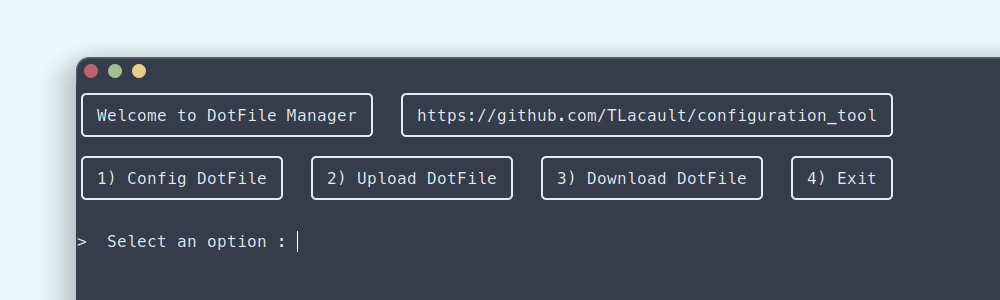
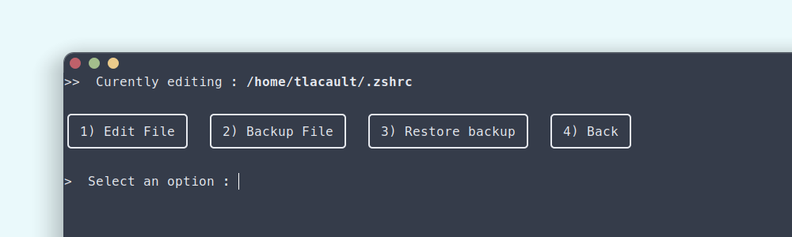

<!-- PROJECT LOGO -->
<br />
<p align="center">
  <a href="https://github.com/TLacault">
    
  </a>

  <h2 align="center">README</h2>
  <h3 align="center">Configuration Tool</h3>

</p>


<!-- TABLE OF CONTENTS -->
<details open="open">
  <summary><strong>Table of Contents</strong></summary>
    <strong>
      <ol>
        <li><a href="#quick-view">Quick View</a></li>
        <li><a href="#project-description">Project Description</a></li>
        <li><a href="#clone-the-repository">Clone The Repository</a></li>
        <li><a href="#contact">Contact</a></li>
      </ol>
  </strong>
</details>

<!-- Quick View -->
## Quick View
<p align="center">
    <a href="https://github.com/TLacault">
        
        
    </a>
</p>

<br />

<!-- Project Description -->
## Project Description

* <strong>The objective of this project is to create a tool that could make configuration a bit easier.
Some of the features I want to add :
    - auto saving dotfiles, upload them on a git repo.
    - edit dotfiles / configuration files via a menu.
    - copy dotfiles from a git repo and apply them to local machine.
    - auto install dependencies for external dotfiles.</strong>

* <strong>I will continue to update this script till these features are implemented.</strong>

<br />

<!-- Clone The Repository -->
## Clone The Repository

* <strong>Clone with HTML</strong>
   ```sh
   git clone https://github.com/TLacault/configuration_tool
   ```

* <strong>Clone with SSH</strong>
   ```sh
   git clone git@github.com:TLacault/configuration_tool.git
   ```

<br />

<!-- Contact -->
## Contact

* <strong>contact@dev-tlacault.eu</strong>

* <strong>Project Link : </strong>[Configuration Tool](https://github.com/TLacault/configuration_tool)
